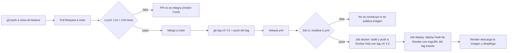
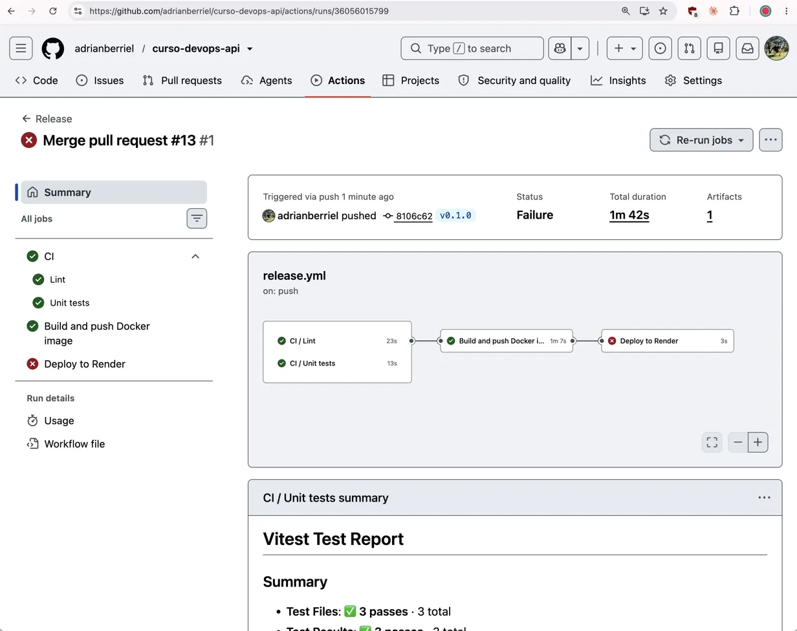
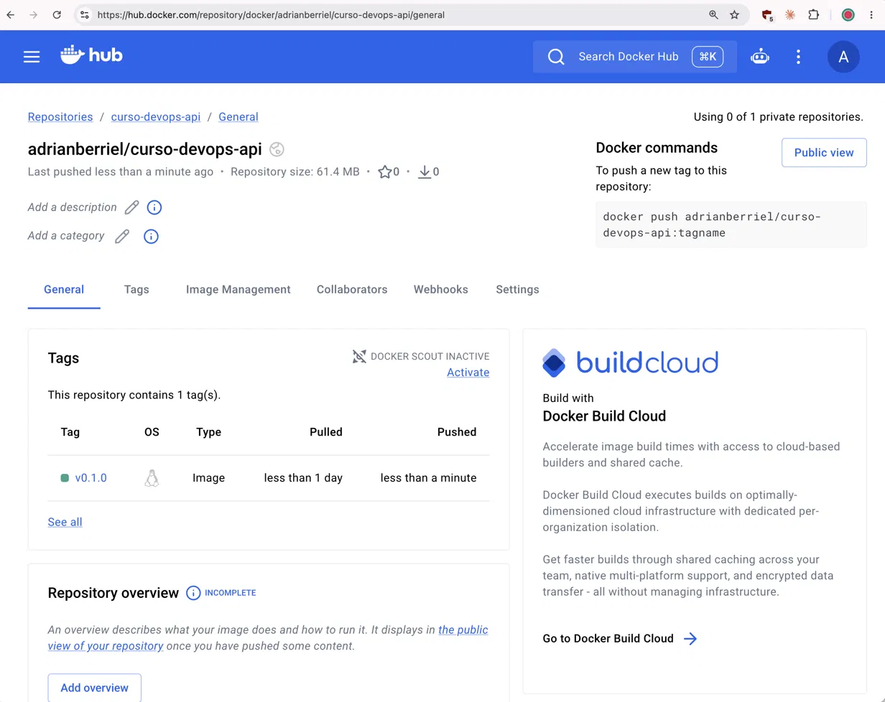

# curso-devops-api

Trabajo Práctico Integrador — Ciclo de Vida y Despliegue Continuo de una API.
Universidad de Palermo, materia DevOps.

API REST desarrollada como caso de estudio para aplicar los principios y herramientas del
movimiento DevOps (Three Ways, Andon Cord, Lean) sobre un ciclo de vida completo: desarrollo,
containerización, CI/CD y observabilidad.

## Stack Tecnológico

- **Runtime / Lenguaje:** Node.js + TypeScript
- **Framework:** [NestJS](https://nestjs.com/)
- **Testing:** [Vitest](https://vitest.dev/) (unitarios y e2e)
- **Linting:** [oxlint](https://oxc.rs/docs/guide/usage/linter.html)

## Estado del Proyecto

### Fase 1 — Desarrollo Base y Documentación

- [x] API REST con lógica de negocio básica (CRUD de `Products`: create/findAll/findOne/update/remove, con DTOs y
  `ValidationPipe` global)
- [ ] Suite de pruebas unitarias — existen specs (`products.service.spec.ts`, `products.controller.spec.ts`,
  `app.e2e-spec.ts`) pero son el boilerplate de `nest generate` (`should be defined`); falta cubrir la lógica real del
  CRUD
- [x] Documentación interactiva (Swagger/OpenAPI) — `@nestjs/swagger`, expuesta en `/api` (Swagger UI) y `/api-json`
  (spec OpenAPI); DTOs anotados vía CLI plugin (`nest-cli.json`), sin requerir `@ApiProperty` manual

### Fase 2 — Gestión de Cambios y Versionado
- [x] Conventional Commits en todo el historial
- [x] Branching vía GitHub Flow + protección de `main` + PRs documentados
- [x] Estrategia de versionado definida (SemVer)
- [x] Primer tag de release (`v0.1.0`) — disparó la primera corrida del workflow `Release`

### Fase 3 — Empaquetado y Entorno (Docker)
- [x] Dockerfile multi-stage
- [x] Imagen base específica, sin `latest` (`node:24.20-alpine3.24`)
- [x] Usuario non-root
- [x] Capas ordenadas para cache
- [x] `docker-compose.yml` funcional
- [x] `.dockerignore`
- [x] Build verificado sin errores (`docker build`, `docker run` y `docker compose` probados)

### Fase 4 — Automatización CI/CD (GitHub Actions)

- [x] Workflow de CI en Pull Requests (linter + tests) — `ci.yml`, corrido y verificado en verde en PR #11
- [x] Andon Cord: PR bloqueado si falla un test — `main` está protegida y requiere PR; pendiente confirmar en Settings >
  Branches que "Require status checks to pass" esté tildado para los jobs de `ci.yml`
- [x] Build y publicación de imagen a Docker Hub — `release.yml` construyó y publicó
  `adrianberriel/curso-devops-api:v0.1.0` (repo público, `linux/amd64`)
- [x] Imagen etiquetada con el tag SemVer de la release — el tag de la imagen es el mismo tag de git (`v0.1.0`); no se
  publica `latest`
- [ ] (Opcional) Deploy Hook a plataforma gratuita con el tag exacto — el job `deploy` falló en la primera corrida
  (motivo por confirmar en el log). El servicio de Render que existía estaba configurado como Git-backed (build desde
  el Dockerfile del repo), no como "Existing Image", y según la documentación de Render el parámetro `imgURL` del
  deploy hook es para servicios image-backed. Pendiente: recrear el servicio como "Existing Image" apuntando a
  `docker.io/adrianberriel/curso-devops-api` y actualizar el secret `RENDER_DEPLOY_HOOK_URL`.

### Fase 5 — Observabilidad y Monitoreo
- [ ] Logs estructurados en JSON (timestamp, level, path, status_code)
- [ ] Conexión a plataforma de monitoreo (Grafana Cloud / Datadog / New Relic / Sentry)
- [ ] Dashboard propio (sin plantillas)
- [ ] Golden Signals: tráfico, latencia, errores

## Cómo correr el proyecto localmente

```bash
npm install
npm run start:dev
```

La documentación interactiva (Swagger UI) queda disponible en `http://localhost:3000/api`, y el spec OpenAPI en
formato JSON en `http://localhost:3000/api-json`.

### Tests

```bash
npm run test       # unitarios
npm run test:e2e   # end-to-end
```

## Convenciones de Desarrollo

### Nombres de Ramas

Formato: `<tipo>/<descripcion-corta-en-kebab-case>`, usando el mismo `<tipo>` que
Conventional Commits:

| Prefijo     | Uso                                                   |
|-------------|-------------------------------------------------------|
| `feat/`     | Nueva funcionalidad                                   |
| `fix/`      | Corrección de un bug                                  |
| `docs/`     | Cambios de documentación                              |
| `chore/`    | Tareas de mantenimiento (deps, config, scaffolding)   |
| `refactor/` | Cambio de código que no agrega feature ni corrige bug |
| `test/`     | Agregar o corregir tests                              |
| `ci/`       | Cambios en el pipeline de CI/CD                       |

Ejemplos: `feat/users-endpoint`, `fix/typo-readme`, `docs/add-readme`.

Toda rama nace de `main` y se integra a `main` exclusivamente vía Pull Request (ver
[Estrategia de Integración](#estrategia-de-integración-branching)). Una vez mergeado el PR,
la rama se elimina.

### Conventional Commits

Todo commit sigue el formato:

```
<tipo>(<scope opcional>): <descripción en imperativo, minúscula, sin punto final>
```

Tipos válidos: `feat`, `fix`, `docs`, `style`, `refactor`, `perf`, `test`, `chore`, `ci`.

Ejemplos:

```
feat(users): agregar endpoint de creación de usuario
fix(auth): corregir validación de token expirado
docs: agregar README con informe técnico
```

Un cambio incompatible hacia atrás se marca agregando `!` después del tipo/scope (ej.
`feat!: cambiar formato de respuesta de la API`) o con un footer `BREAKING CHANGE:`.

---

## Informe Técnico

<!--
Imágenes por agregar en docs/images/ (los nombres deben coincidir con las referencias del informe):
- pipeline-release.png        corrida "Release" completa (jobs ci, docker, deploy) con todo en verde
- pr-checks.png               Pull Request con los checks de CI (Lint y Unit tests)
- branch-protection.png       configuración de protección de `main`
- dockerhub-tags.png          lista de tags del repo en Docker Hub
- dockerhub-tag-detalle.png   detalle de v0.1.0 (linux/amd64, tamaño)
- render-servicio.png         servicio en Render corriendo con la imagen del tag
- render-deploy-hook.png      deploy disparado por el hook (eventos / log)
- monitoreo-dashboard.png     dashboard propio con las Golden Signals
- falla-controlada-1.png      evidencia del experimento de falla controlada
-->

### 1. Arquitectura del Pipeline

#### Diagrama de flujo



_La etapa de Render (últimos dos pasos) está pendiente de verificar._




#### Componentes

| Componente             | Herramienta                                                       |
|------------------------|-------------------------------------------------------------------|
| Control de versiones   | GitHub (GitHub Flow, `main` protegida, Pull Requests)             |
| Linter                 | oxlint (`npm run lint`)                                           |
| Tests                  | Vitest (`npm test`)                                               |
| Runner de CI           | GitHub Actions (`ubuntu-latest`)                                  |
| Registro de imágenes   | Docker Hub — repo público `adrianberriel/curso-devops-api`        |
| Plataforma de hosting  | Render, plan Free (pendiente)                                     |
| Monitoreo              | Pendiente (Fase 5)                                                |

#### Workflows

- **`ci.yml`:** se ejecuta en Pull Requests hacia `main` y además es reutilizable (`workflow_call`). Tiene dos jobs:
  `Lint` y `Unit tests`.
- **`release.yml`:** se dispara al pushear un tag `v*.*.*`. Sus jobs se encadenan con `needs`: `ci` (reutiliza
  `ci.yml`) → `docker` (build y push a Docker Hub) → `deploy` (deploy hook de Render).
- **Credenciales:** secrets del repositorio (`DOCKERHUB_USERNAME`, `DOCKERHUB_TOKEN`, `RENDER_DEPLOY_HOOK_URL`); nunca
  en el código.

### 2. Justificación Técnica y Decisiones de Diseño

#### Estrategia de Integración (Branching)

Se adoptó **GitHub Flow**: ramas de feature de vida corta creadas desde `main`, integradas
exclusivamente vía Pull Request, con `main` protegida (push directo deshabilitado, PR
obligatorio antes de mergear).

Se descartaron las otras dos estrategias vistas en el curso:

- **Trunk-Based Development** está orientado a equipos maduros con varios desarrolladores
  integrando cambios múltiples veces al día sobre una única rama, apoyándose en *feature
  flags* para no exponer código incompleto. Al ser un desarrollo individual, el problema
  central que resuelve (evitar divergencia entre desarrolladores) no aplica, y la
  complejidad adicional no aporta valor real en este contexto.
- **Git Flow** está pensado para ciclos de release formales con múltiples versiones en
  soporte simultáneo (`develop`, `release/*`, `hotfix/*`), lo cual excede la complejidad
  necesaria para este proyecto.

Según la comparación del material del curso, GitHub Flow es la estrategia de baja
complejidad recomendada para equipos pequeños — el caso de este TP.

**Protección de `main`:**


_Pendiente: confirmar en Settings > Branches (o Rulesets) que "Require status checks to pass" esté activo para los
jobs `Lint` y `Unit tests`; de eso depende que el Andon Cord bloquee el merge de un PR con el CI en rojo._

#### Optimización de Contenedores (Dockerfile)

Build **multi-stage**: un stage `builder` con las dependencias completas (incluyendo
devDependencies) que compila el proyecto (`npm run build`), y un stage `runner` liviano
que solo recibe el resultado (`dist/`) y las dependencias de producción (`npm prune --omit=dev`). El código fuente,
TypeScript y las herramientas de build nunca
llegan a la imagen final.

- **Imagen base:** `node:24.20-alpine3.24` en ambos stages — Node 24 es la versión LTS
  activa actual, pineada a un patch y una versión de Alpine específicos (no tags
  flotantes como `24-alpine` ni `latest`) para builds reproducibles.
- **Usuario non-root:** se reutiliza el usuario `node` que ya trae la imagen oficial de
  Node (en vez de correr como root o crear un usuario nuevo a mano) — recomendación
  explícita de
  la [guía oficial de Node en Docker](https://github.com/nodejs/docker-node/blob/main/docs/BestPractices.md).
- **Orden de capas para cache:** se copian primero `package.json` / `package-lock.json`
  y se corre `npm ci` antes de copiar el código fuente. Como las dependencias cambian
  mucho menos seguido que el código, esa capa se reutiliza en la mayoría de los builds.
- **Manejo de señales:** Node.js no fue diseñado para correr como proceso PID 1 (no
  reacciona correctamente a `SIGTERM`/`SIGINT`), según la misma guía oficial. En vez de
  agregar un binario extra (`tini`/`dumb-init`) a la imagen, se usa `init: true` en el
  `docker-compose.yml`, que le pide a Docker que envuelva el proceso con su init liviano
  incorporado.

**Evidencia:** la imagen publicada (`adrianberriel/curso-devops-api:v0.1.0`) es `linux/amd64` y pesa 61.32 MB
comprimida en Docker Hub.


#### Orquestación Local

`docker-compose.yml` con un único servicio (`api`) que construye la imagen desde el
Dockerfile y expone el puerto 3000. Permite levantar el entorno completo con
`docker compose up --build`.

#### Estrategia de Versionado

Se adoptó **Semantic Versioning (SemVer)** (`MAJOR.MINOR.PATCH`, ej. `v1.0.0`).

Al usar Conventional Commits, el tipo de cada commit determina automáticamente el
incremento de versión (`feat` → minor, `fix` → patch, `BREAKING CHANGE` → major), lo que
permite automatizar el tagging dentro del pipeline en lugar de versionar a mano. Esto
también es coherente con la Fase 4, que exige que la imagen publicada en Docker Hub quede
etiquetada con la versión SemVer generada en la release.

El versionado no es solo el campo `version` de `package.json` (que hoy refleja desarrollo
inicial, `0.x.y`) — lo que realmente traza una release es un **tag de git inmutable** sobre
el commit exacto:

```bash
git tag -a v0.1.0 -m "Release v0.1.0"
git push origin v0.1.0
```

Ese tag es el que `release.yml` usa para nombrar la imagen Docker: el tag de la imagen es exactamente el tag de git
(`v0.1.0`) y no se publica `latest`. Hoy el tag se crea a mano (`git tag` + `git push`); lo que el pipeline automatiza
es el build y la publicación etiquetada a partir de él.

Primera release publicada: `adrianberriel/curso-devops-api:v0.1.0`.



### 3. Aplicación de la Filosofía DevOps

_Borrador. Los apartados marcados como Pendiente dependen de la Fase 5 o del experimento de falla controlada._

#### Primera Forma (Flujo y Consistencia)

**Tareas manuales que quedaron automatizadas**

- Lint y tests unitarios en cada Pull Request (`ci.yml`).
- Build de la imagen Docker y publicación en Docker Hub con el tag de la release (`release.yml`), sin
  `docker build` / `docker push` manuales.
- Aviso del deploy a Render mediante deploy hook con el tag exacto (_pendiente de verificar en Render_).
- Sigue siendo manual: crear el tag SemVer (`git tag` + `git push`).

**Consistencia del entorno**

- El mismo `Dockerfile` se usa en local (`docker compose`) y en CI (build de la release), con imagen base pineada
  (`node:24.20-alpine3.24`) y dependencias instaladas con `npm ci` desde el lockfile.
- La imagen se construye una sola vez en CI; ese artefacto, identificado por su tag, es el que debe desplegarse
  (_pendiente de verificar en Render_).
- Matiz: `Lint` y `Unit tests` corren directamente en el runner con Node 24 (el mismo major que la imagen), no dentro
  del contenedor.

#### Segunda Forma (Feedback rápido y Andon Cord)

**Puntos donde el flujo corta el cable**

1. **Pull Request:** si `Lint` o `Unit tests` fallan, el check queda en rojo. Que el merge quede bloqueado depende de
   que "Require status checks to pass" esté activo en la protección de `main` (_pendiente de confirmar_).
2. **Release:** el job `docker` tiene `needs: ci`, así que si lint o tests fallan sobre el tag no se construye ni se
   publica la imagen; el job `deploy` tiene `needs: docker`, así que no se dispara si la imagen no se publicó.

**Velocidad del feedback:** en la primera release, `Lint` tardó 23 s, `Unit tests` 13 s y el build y push de la
imagen 1 m 7 s.

**Visibilidad de fallos (errores 5xx o latencia alta):** _Pendiente — depende de la Fase 5 (logs JSON, plataforma de
monitoreo y alertas)._


#### Tercera Forma (Aprendizaje y simulación de fallos)

_Pendiente — experimento de falla controlada._ Estructura a completar:

- **Escenario:** qué se rompió intencionalmente (por ejemplo, un test unitario fallido en un PR o una variable de
  entorno faltante).
- **Reacción del sistema:** qué job falló, en qué punto se cortó el flujo y cómo se enteró el equipo (check rojo,
  log, alerta).
- **Evidencia:**

  

- **Aprendizaje:** qué se cambió a partir de la falla.

### 4. Principios Lean (Reducción de Desperdicio)

_Borrador — a revisar y completar con la evidencia final._

1. **Esperas y trabajo manual de empaquetado.** Sin pipeline, construir y publicar la imagen dependería de que alguien
   ejecute los pasos a mano en cada release. `release.yml` lo hace al pushear el tag.
2. **Defectos detectados tarde.** `ci.yml` corre lint y tests en cada Pull Request, y el mismo CI se vuelve a ejecutar
   sobre el tag antes de publicar (`needs: ci`), de modo que un defecto se frena antes de llegar al registro.
3. **Retrabajo por diferencias de entorno.** Un `Dockerfile` multi-stage con base pineada, usado igual en local y en
   CI, evita el "en mi máquina funciona"; además la imagen final es liviana (61.32 MB comprimida), lo que reduce la
   transferencia en cada publicación y despliegue.