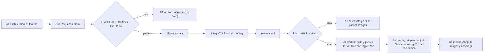

# curso-devops-api

Trabajo Práctico Integrador — Ciclo de Vida y Despliegue Continuo de una API.
Universidad de Palermo, materia DevOps.

API REST desarrollada como caso de estudio para aplicar los principios y herramientas del
movimiento DevOps (Three Ways, Andon Cord, Lean) sobre un ciclo de vida completo: desarrollo,
containerización, CI/CD y observabilidad.

## Stack Tecnológico

- **Runtime / Lenguaje:** Node.js + TypeScript
- **Framework:** [NestJS](https://nestjs.com/)
- **Testing:** [Vitest](https://vitest.dev/) (unitarios y e2e)
- **Linting:** [oxlint](https://oxc.rs/docs/guide/usage/linter.html)

La API está desplegada en [`curso-devops-api.onrender.com`](https://curso-devops-api.onrender.com) — documentación
interactiva en [`/api`](https://curso-devops-api.onrender.com/api).

El seguimiento del avance contra las fases de la consigna vive en
[`docs/estado-del-proyecto.md`](docs/estado-del-proyecto.md). Este README es el **informe técnico** del trabajo.

## Cómo correr el proyecto localmente

```bash
npm install
npm run start:dev
```

La documentación interactiva (Swagger UI) queda disponible en `http://localhost:3000/api`, y el spec OpenAPI en
formato JSON en `http://localhost:3000/api-json`.

Los logs salen en JSON de una línea (ver [Logs Estructurados](#logs-estructurados)). Para leerlos más cómodo en
desarrollo, `npm run start:dev:pretty` los pasa por `jq`, que los indenta y colorea; si `jq` no está instalado el
script avisa cómo instalarlo y no arranca.

### Con Docker y telemetría hacia Grafana Cloud

La instrumentación de OpenTelemetry se configura en el Dockerfile, así que se activa al correr en contenedor (ver
[Observabilidad](#observabilidad-opentelemetry--grafana-cloud)). Para que los datos lleguen a Grafana Cloud hay que
cargar las credenciales:

```bash
cp .env.example .env   # completar con los valores del asistente de Grafana Cloud
docker compose up --build
```

`.env` está en `.gitignore` y en `.dockerignore`: el token no se commitea ni queda dentro de la imagen. Si no se crea
el archivo, la aplicación arranca igual (el `env_file` está declarado como `required: false`) y solo falla el envío de
telemetría.

### Tests

```bash
npm run test       # unitarios
npm run test:e2e   # end-to-end
npm run test:cov   # unitarios + reporte de cobertura
```

Los unitarios y los e2e corren en CI como jobs separados en cada Pull Request; la cobertura se consulta localmente.

---

## Informe Técnico

### 1. Arquitectura del Pipeline

#### Diagrama de flujo


```mermaid
flowchart LR
    A["git push a rama de feature"] --> B["Pull Request a main"]
    B --> C{"ci.yml: Lint + Unit tests + E2E tests"}
    C -- "falla" --> X["PR no se integra (Andon Cord)"]
    C -- "pasa" --> D["Merge a main"]
    D --> E["git tag vX.Y.Z + push del tag"]
    E --> F["release.yml"]
    F --> G{"Job ci: reutiliza ci.yml"}
    G -- "falla" --> Y["No se construye ni se publica imagen"]
    G -- "pasa" --> H["Job docker: build y push a Docker Hub con tag vX.Y.Z"]
    H --> I["Job deploy: deploy hook de Render con imgURL del tag exacto"]
    I --> J["Render descarga la imagen y despliega"]
```

_La etapa de Render se verificó de punta a punta: el deploy hook de la release `v0.3.0` (la actual) disparó el deploy
y el servicio quedó corriendo esa imagen en producción, exportando telemetría real a Grafana Cloud._


_Esa captura corresponde a la primera corrida (release `v0.1.0`), con el job `Deploy to Render` en rojo — es la falla
descrita en Fase 4. Las releases `v0.2.0` y `v0.3.0` corrieron el pipeline completo sin ese error; falta reemplazar la
captura por una corrida en verde._

<!-- pr-checks.png: captura pendiente de agregar (Pull Request con los checks de CI en verde) -->

#### Componentes

| Componente             | Herramienta                                                       |
|------------------------|-------------------------------------------------------------------|
| Control de versiones   | GitHub (GitHub Flow, `main` protegida, Pull Requests)             |
| Linter                 | oxlint (`npm run lint`)                                           |
| Tests                  | Vitest (`npm test`)                                               |
| Runner de CI           | GitHub Actions (`ubuntu-latest`)                                  |
| Registro de imágenes   | Docker Hub — repo público `adrianberriel/curso-devops-api`        |
| Plataforma de hosting  | Render, plan Free — imagen `v0.3.0` corriendo en producción       |
| Instrumentación        | OpenTelemetry (zero-code, export OTLP directo, sin agente)        |
| Monitoreo              | Grafana Cloud — Application Observability                         |

#### Workflows

- **`ci.yml`:** se ejecuta en Pull Requests hacia `main` y además es reutilizable (`workflow_call`). Tiene tres
  jobs, que corren en paralelo: `Lint`, `Unit tests` y `E2E tests`.
- **`release.yml`:** se dispara al pushear un tag `v*.*.*`. Sus jobs se encadenan con `needs`: `ci` (reutiliza
  `ci.yml`) → `docker` (build y push a Docker Hub) → `deploy` (deploy hook de Render).
- **Credenciales:** secrets del repositorio (`DOCKERHUB_USERNAME`, `DOCKERHUB_TOKEN`, `RENDER_DEPLOY_HOOK_URL`); nunca
  en el código.

### 2. Justificación Técnica y Decisiones de Diseño

#### Gestión de Cambios (Commits, Ramas y PRs)

Las tres convenciones de esta sección no son independientes: el tipo del commit define el prefijo de la rama y, a
través de SemVer, el incremento de versión de la release. Una sola taxonomía atraviesa todo el ciclo.

**Conventional Commits.** Todo commit sigue el formato:

```
<tipo>(<scope opcional>): <descripción en imperativo, minúscula, sin punto final>
```

Tipos válidos: `feat`, `fix`, `docs`, `style`, `refactor`, `perf`, `test`, `chore`, `ci`. Ejemplos reales del
historial:

```
feat(products): logica CRUD con almacenamiento en memoria
fix(auth): corregir validación de token expirado
ci: add e2e job to pull request checks
```

Un cambio incompatible hacia atrás se marca con `!` después del tipo/scope (ej.
`feat!: cambiar formato de respuesta de la API`) o con un footer `BREAKING CHANGE:`. Eso es lo que habilita derivar
el incremento SemVer del historial en lugar de decidirlo a mano (ver
[Estrategia de Versionado](#estrategia-de-versionado)).

**Nombres de ramas.** Formato `<tipo>/<descripcion-corta-en-kebab-case>`, reutilizando los mismos tipos:

| Prefijo     | Uso                                                   |
|-------------|-------------------------------------------------------|
| `feat/`     | Nueva funcionalidad                                   |
| `fix/`      | Corrección de un bug                                  |
| `docs/`     | Cambios de documentación                              |
| `chore/`    | Tareas de mantenimiento (deps, config, scaffolding)   |
| `refactor/` | Cambio de código que no agrega feature ni corrige bug |
| `test/`     | Agregar o corregir tests                              |
| `ci/`       | Cambios en el pipeline de CI/CD                       |

Ejemplos: `feat/users-endpoint`, `ci/github-actions-ci-cd`, `docs/update-readme-status`. Toda rama nace de `main`,
se integra exclusivamente vía Pull Request (ver [Estrategia de Integración](#estrategia-de-integración-branching)) y
se elimina una vez mergeada.

**Documentación de los Pull Requests.** El repositorio define
[`.github/pull_request_template.md`](.github/pull_request_template.md), de modo que cada PR se abre ya con la
estructura a completar en lugar de depender de que el autor se acuerde:

```markdown
## Description


## Test evidence
<!-- Paste the output of `npm run test` / `npm run test:e2e`, or N/A if not applicable -->
```

Son los dos campos que pide la consigna — descripción del cambio y evidencia de pruebas ejecutadas — y la plantilla
los convierte en el estado por defecto del PR. La evidencia se pega a mano en el cuerpo, pero además queda registrada
de forma automática e inmutable en los checks de CI del propio PR (`Lint`, `Unit tests`, `E2E tests`), que corren
sobre el commit exacto que se va a mergear.

#### Estrategia de Integración (Branching)

Se adoptó **GitHub Flow**: ramas de feature de vida corta creadas desde `main`, integradas
exclusivamente vía Pull Request, con `main` protegida (push directo deshabilitado, PR
obligatorio antes de mergear).

Se descartaron las otras dos estrategias vistas en el curso:

- **Trunk-Based Development** está orientado a equipos maduros con varios desarrolladores
  integrando cambios múltiples veces al día sobre una única rama, apoyándose en *feature
  flags* para no exponer código incompleto. Al ser un desarrollo individual, el problema
  central que resuelve (evitar divergencia entre desarrolladores) no aplica, y la
  complejidad adicional no aporta valor real en este contexto.
- **Git Flow** está pensado para ciclos de release formales con múltiples versiones en
  soporte simultáneo (`develop`, `release/*`, `hotfix/*`), lo cual excede la complejidad
  necesaria para este proyecto.

Según la comparación del material del curso, GitHub Flow es la estrategia de baja
complejidad recomendada para equipos pequeños — el caso de este TP.

**Protección de `main`:**

<!-- branch-protection.png: captura pendiente de agregar (Settings > Branches para main) -->

`main` exige PR (no admite push directo) y tiene "Require status checks to pass" activo para `Lint`, `Unit tests` y
`E2E tests` (verificado con `gh api repos/adrianberriel/curso-devops-api/branches/main/protection`) — un PR con
cualquiera de esos tres checks en rojo no se puede mergear. Sigue sin exigir aprobaciones
(`required_approving_review_count: 0`), pero eso es un control distinto del Andon Cord.

#### Estrategia de Pruebas

Los tests son la condición que corta el flujo en un Pull Request, así que lo que importa no es solo que pasen sino
que el número que reportan sea confiable.

Las pruebas siguen el patrón de `@nestjs/testing`: cada test construye el módulo con `Test.createTestingModule`, lo
que da una instancia nueva por caso y evita estado compartido entre tests. El servicio guarda los productos en
memoria y se prueba directo; en el controlador el servicio va mockeado (`useValue`), porque lo único propio que tiene
es convertir el `id` de la URL de string a número — la lógica del CRUD ya está cubierta en el test del servicio y no
tiene sentido volver a ejercitarla a través suyo.

**El denominador de la cobertura.** Por defecto, Vitest solo mide los archivos que algún test importa: los que no
tienen test quedan fuera de la cuenta y el porcentaje sale inflado. Con esa configuración el proyecto reportaba
100 %, y midiendo todo `src/` el número real era 79 %. Por eso `vitest.config.ts` declara `coverage.include`
explícitamente, y excluye solo lo que no tiene lógica que probar:

| Excluido | Motivo |
|---|---|
| `src/main.ts` | Bootstrap: levanta el servidor, sin lógica propia |
| `src/**/*.module.ts` | Solo declaran `controllers` y `providers` |

Con ese denominador la cobertura es de 100 % en statements y funciones. El 90 % en ramas corresponde a una sola rama
sin cubrir, que es el decorador `@Controller()` de `app.controller.ts`: un artefacto de la instrumentación, no un
camino de código real.

**Los e2e tienen que probar la app que se despliega.** Los tests end-to-end no ejecutan `main.ts`: arman la
aplicación con `createNestApplication()`. Como la configuración global vivía dentro de `bootstrap()`, la app de los
tests salía sin el `ValidationPipe` y por lo tanto no validaba nada. Un `POST /products` con un body inválido
devolvía **201 en los tests y 400 en producción**: la suite habría dado luz verde a una regresión en la validación.

La corrección fue extraer esa configuración a `src/app.setup.ts` (`configureApp`), que ahora usan tanto `main.ts`
como los e2e, de modo que no puedan volver a divergir. Se verificó quitando la llamada del setup de los tests: 6 de
los 16 e2e fallan, así que la suite detecta efectivamente esa clase de regresión. Swagger se queda en `main.ts`
porque expone documentación y no altera el manejo de los requests.

Es el mismo problema de paridad entre entornos que motivó el Dockerfile y la decisión sobre los colores del logger,
solo que acá afectaba a la propia red de contención.

#### Optimización de Contenedores (Dockerfile)

Build **multi-stage**: un stage `builder` con las dependencias completas (incluyendo
devDependencies) que compila el proyecto (`npm run build`), y un stage `runner` liviano
que solo recibe el resultado (`dist/`) y las dependencias de producción (`npm prune --omit=dev`). El código fuente,
TypeScript y las herramientas de build nunca
llegan a la imagen final.

- **Imagen base:** `node:24.20-alpine3.24` en ambos stages — Node 24 es la versión LTS
  activa actual, pineada a un patch y una versión de Alpine específicos (no tags
  flotantes como `24-alpine` ni `latest`) para builds reproducibles.
- **Usuario non-root:** se reutiliza el usuario `node` que ya trae la imagen oficial de
  Node (en vez de correr como root o crear un usuario nuevo a mano) — recomendación
  explícita de
  la [guía oficial de Node en Docker](https://github.com/nodejs/docker-node/blob/main/docs/BestPractices.md).
- **Orden de capas para cache:** se copian primero `package.json` / `package-lock.json`
  y se corre `npm ci` antes de copiar el código fuente. Como las dependencias cambian
  mucho menos seguido que el código, esa capa se reutiliza en la mayoría de los builds.
- **Manejo de señales:** Node.js no fue diseñado para correr como proceso PID 1 (no
  reacciona correctamente a `SIGTERM`/`SIGINT`), según la misma guía oficial. En vez de
  agregar un binario extra (`tini`/`dumb-init`) a la imagen, se usa `init: true` en el
  `docker-compose.yml`, que le pide a Docker que envuelva el proceso con su init liviano
  incorporado.

**Evidencia:** las imágenes publicadas son `linux/amd64`. `v0.1.0` pesa 61.32 MB, `v0.2.0` 70.12 MB y `v0.3.0` (la que
corre en producción) 79.61 MB comprimida en Docker Hub — el crecimiento viene de las dependencias de OpenTelemetry
agregadas entre releases.

<!-- dockerhub-tag-detalle.png: captura pendiente de agregar (detalle del tag v0.3.0: linux/amd64, tamaño) -->

#### Orquestación Local

`docker-compose.yml` con un único servicio (`api`) que construye la imagen desde el
Dockerfile y expone el puerto 3000. Permite levantar el entorno completo con
`docker compose up --build`.

#### Logs Estructurados

Los logs se emiten como eventos JSON de una línea, en vez de texto plano legible por humanos: es el formato que
consumen los agregadores de logs (CloudWatch, Grafana Loki, Datadog), donde cada campo queda indexado y se puede
filtrar o graficar — por ejemplo, contar 5xx por minuto para las Golden Signals.

Se usó el `ConsoleLogger` que ya trae NestJS con `json: true`
([documentación oficial](https://docs.nestjs.com/techniques/logger#json-logging)), en lugar de sumar una dependencia
como `pino` o `winston`: el requerimiento se cubre con el logger nativo, y evitar la dependencia extra mantiene la
imagen final más liviana.

- **`src/main.ts`:** el `ConsoleLogger` se configura con `json: true` y `flattenParams: true` (los campos propios
  quedan en la raíz del objeto en vez de anidados bajo `params`, más cómodo de consultar en el agregador).
- **`src/common/middleware/logger.middleware.ts`:** middleware global (patrón `NestMiddleware`, registrado en
  `AppModule` vía `configure()`) que se suscribe al evento `finish` de la response. Se eligió `finish` en lugar de
  loguear en el camino de ida porque es el único punto donde el `status_code` ya es el definitivo: así quedan
  registrados también los 404 y los 400 que resuelven el `ValidationPipe` o los filtros de excepción, sin llegar al
  controller.
- **`level` derivado del `status_code`:** 5xx se loguea como `error`, 4xx como `warn` y el resto como `log`. Así los
  fallos se filtran por un campo categórico (`level="error"`) en lugar de tener que expresar rangos numéricos sobre
  `status_code`, que es lo que pide la mayoría de los agregadores para definir una alerta.

Ejemplo de dos eventos, un request exitoso y uno fallido (un objeto JSON por línea, formato JSON Lines):

```jsonl
{"level":"log","pid":78527,"timestamp":1790542855650,"message":"GET /products 200","context":"HTTP","method":"GET","path":"/products","status_code":200}
{"level":"warn","pid":78527,"timestamp":1790542855660,"message":"GET /products/999 404","context":"HTTP","method":"GET","path":"/products/999","status_code":404}
```

**Sobre los colores en desarrollo.** Se probó activar `colors: true` fuera de producción, para que los logs fueran
más legibles en la terminal, y se descartó: con esa opción la salida deja de ser JSON parseable (verificado contra
`JSON.parse`). Habría significado que la aplicación emita un formato en desarrollo y otro en producción — el mismo
problema de paridad de entornos que evita el Dockerfile.

La solución fue dejar la aplicación emitiendo siempre JSON válido y mover el color a la capa de visualización, con
`jq` sobre el stream:

```bash
npm run start:dev:pretty   # equivale a: nest start --watch | jq -Rr --unbuffered 'fromjson? // .'
```

El filtro `fromjson? // .` deja pasar las líneas que no son JSON (errores de compilación, banners) en vez de cortar
el pipe, y el script avisa si falta `jq` en lugar de fallar con un error de shell.

Como el stream sigue siendo JSON válido, también se puede consultar con filtros — por ejemplo, ver solo los
requests fallidos:

```bash
npm run start:dev | jq 'select(.context == "HTTP" and .level != "log")'
```

**Limitación conocida: `path` es la URL concreta, no la ruta.** Se loguea `req.originalUrl`, que incluye los
parámetros y el query string (`/products/3?x=1`). Para logs es lo que se quiere: interesa el request puntual que
falló. Para **métricas** no sirve agrupar por ese valor — cada ID genera una serie temporal distinta y hace explotar
la cardinalidad; ahí conviene agrupar por el patrón de ruta (`/products/:id`). No se resolvió a mano en el middleware
porque la instrumentación de OpenTelemetry para Express ya expone la ruta normalizada, así que queda como parte del
ítem de monitoreo de la Fase 5 y no como lógica propia que habría que mantener.

Esto quedó confirmado al instrumentar con OpenTelemetry: un request a `/products/999` que termina en 404 produce la
métrica con `http.route="/products/:id"`, el patrón y no la URL concreta. La cardinalidad queda acotada sin escribir
código propio.

#### Observabilidad: OpenTelemetry → Grafana Cloud

La aplicación exporta **trazas y métricas** por OTLP directamente a Grafana Cloud, con instrumentación *zero-code*:
no hay un archivo de bootstrap escrito a mano ni cambios en el código de la aplicación, solo configuración. Se
descartó desplegar un agente intermedio (Grafana Alloy) porque agregaría un contenedor más que habría que operar y
replicar en Render, cuando la app puede hablar OTLP por su cuenta.

No se copió el comando del asistente tal cual: se verificó primero contra la documentación de OpenTelemetry y
probándolo, porque el comando que sugiere deja la instrumentación incompleta en este proyecto. El detalle técnico
(por qué hace falta un hook de ESM y cómo se carga en Node 24) está comentado en `otel-hook.mjs`, junto al código.

**Dónde vive cada variable.** El criterio es qué es secreto y qué tiene que valer igual en los dos entornos:

| Variable | Dónde | Por qué |
|---|---|---|
| `NODE_OPTIONS`, `OTEL_SERVICE_NAME`, `OTEL_*_EXPORTER`, `OTEL_EXPORTER_OTLP_PROTOCOL` | `Dockerfile` | No son secretos y deben valer igual en local y en Render: quedan dentro de la imagen |
| `OTEL_EXPORTER_OTLP_ENDPOINT`, `OTEL_EXPORTER_OTLP_HEADERS` | `.env` (local) / variables del servicio (Render) | El header lleva el token. `.env` está en `.gitignore` y en `.dockerignore` |
| `OTEL_RESOURCE_ATTRIBUTES` (`deployment.environment`) | `docker-compose.yaml` (`development`) / Render (`production`) | Es lo único que cambia entre entornos |

Las dependencias van en `dependencies`, no en `devDependencies`, porque el Dockerfile hace `npm prune --omit=dev`
antes de armar la imagen final (verificado: el prune no remueve ningún paquete de OpenTelemetry).

**Logs.** `OTEL_LOGS_EXPORTER` queda en `none` a propósito. La auto-instrumentación solo captura logs de `pino`,
`winston` y `bunyan`; el `ConsoleLogger` de NestJS no está en esa lista, así que ponerlo en `otlp` no enviaría nada.
Los logs JSON se recogen por stdout, que es lo que pide la consigna.

**Verificación.** El flujo se probó primero de punta a punta contra un receptor OTLP local, antes de tener
credenciales de Grafana, después se confirmó contra Grafana Cloud en local (`docker compose`), y finalmente **contra
producción**: tráfico real a `curso-devops-api.onrender.com` (release `v0.3.0`) aparece en minutos como trazas en
Tempo y como métricas en Prometheus, con `deployment_environment=production`, sin errores de exportación. La métrica
que alimenta las Golden Signals es `http.server.request.duration` (histograma en segundos) con los atributos
`http.route`, `http.request.method` y `http.response.status_code`; en Prometheus queda como
`http_server_request_duration_seconds_{bucket,sum,count}`.

**Cómo se llegó ahí: una hipótesis equivocada.** Esta última verificación no fue inmediata, y el camino es más
ilustrativo que el resultado. Al consultar Grafana Cloud por primera vez, **todo** lo que había tenía
`deployment_environment=development`: ni un dato de Render, pese a que el servicio estaba `live` y respondía tráfico
real. La hipótesis inicial fue la obvia — faltaban las variables OTLP en el servicio— así que se cargaron
`OTEL_EXPORTER_OTLP_ENDPOINT`, `OTEL_EXPORTER_OTLP_HEADERS` y `OTEL_RESOURCE_ATTRIBUTES` con las credenciales reales.
Seguía sin llegar nada. Se descartaron las explicaciones fáciles una por una: se validó el endpoint y el token por
separado con `curl` contra el gateway OTLP (200 OK, credencial correcta), y se generó tráfico en varias tandas, hasta
24 h después, para descartar demoras de ingesta. Tampoco aparecía un solo log JSON por request en la salida de Render.

La causa real no estaba en la configuración sino en **qué artefacto se estaba ejecutando**: Render corría la imagen
`v0.2.0`, publicada por la release de Swagger (PR #15), **anterior** a los PRs que agregaron el `LoggerMiddleware` y
la instrumentación de OpenTelemetry (#16, #17, #18). Se confirmó leyendo el código de ese tag:
`git show v0.2.0:Dockerfile` no tiene el `NODE_OPTIONS` del hook de OTel, y `logger.middleware.ts` no existe en ese
árbol. El binario desplegado simplemente no tenía ese código, y ninguna variable de entorno podía cambiarlo. La
solución fue cortar la release `v0.3.0` sobre `main`; minutos después del deploy, el tráfico real ya aparecía en
Tempo y Prometheus con `deployment_environment=production`.

Es otra vez el problema de **paridad entre entornos** que motivó el Dockerfile y la extracción de `configureApp` en
los e2e, pero en su versión más cara: no divergían las configuraciones, divergía la *versión*. Lo que se probaba en
local y lo que corría en producción eran dos builds distintos, y nada en el pipeline lo hacía evidente — el deploy
decía "success" porque desplegó correctamente la imagen equivocada. El aprendizaje quedó incorporado en el checklist
de verificación: comprobar siempre contra qué tag corre producción antes de diagnosticar por qué "no funciona".

#### Estrategia de Versionado

Se adoptó **Semantic Versioning (SemVer)** (`MAJOR.MINOR.PATCH`, ej. `v1.0.0`).

Al usar Conventional Commits, el tipo de cada commit determina automáticamente el
incremento de versión (`feat` → minor, `fix` → patch, `BREAKING CHANGE` → major), lo que
permite automatizar el tagging dentro del pipeline en lugar de versionar a mano. Esto
también es coherente con la Fase 4, que exige que la imagen publicada en Docker Hub quede
etiquetada con la versión SemVer generada en la release.

El versionado no es solo el campo `version` de `package.json` (que hoy refleja desarrollo
inicial, `0.x.y`) — lo que realmente traza una release es un **tag de git inmutable** sobre
el commit exacto:

```bash
git tag -a v0.1.0 -m "Release v0.1.0"
git push origin v0.1.0
```

Ese tag es el que `release.yml` usa para nombrar la imagen Docker: el tag de la imagen es exactamente el tag de git
(`v0.1.0`) y no se publica `latest`. Hoy el tag se crea a mano (`git tag` + `git push`); lo que el pipeline automatiza
es el build y la publicación etiquetada a partir de él.

Primera release publicada: `adrianberriel/curso-devops-api:v0.1.0`. Release actual, deployada en Render:
`adrianberriel/curso-devops-api:v0.3.0`.


_Esa captura es de cuando solo existía el tag `v0.1.0`; falta actualizarla para que muestre también `v0.2.0` y `v0.3.0`._

### 3. Aplicación de la Filosofía DevOps

_Borrador. Los apartados marcados como Pendiente dependen de la Fase 5 o del experimento de falla controlada._

#### Primera Forma (Flujo y Consistencia)

**Tareas manuales que quedaron automatizadas**

- Lint y tests unitarios en cada Pull Request (`ci.yml`).
- Build de la imagen Docker y publicación en Docker Hub con el tag de la release (`release.yml`), sin
  `docker build` / `docker push` manuales.
- Aviso del deploy a Render mediante deploy hook con el tag exacto — confirmado con `v0.2.0` y `v0.3.0`: cada release
  disparó el hook y el servicio quedó corriendo esa imagen.
- Sigue siendo manual: crear el tag SemVer (`git tag` + `git push`).

**Consistencia del entorno**

- El mismo `Dockerfile` se usa en local (`docker compose`) y en CI (build de la release), con imagen base pineada
  (`node:24.20-alpine3.24`) y dependencias instaladas con `npm ci` desde el lockfile.
- La imagen se construye una sola vez en CI; ese artefacto, identificado por su tag, es el que se despliega —
  confirmado: Render corre exactamente la imagen `v0.3.0` publicada en Docker Hub.
- Matiz: los tres jobs corren directamente en el runner con Node 24 (el mismo major que la imagen), no dentro
  del contenedor.

#### Segunda Forma (Feedback rápido y Andon Cord)

**Puntos donde el flujo corta el cable**

1. **Pull Request:** si `Lint`, `Unit tests` o `E2E tests` fallan, el check queda en rojo y GitHub bloquea el merge —
   "Require status checks to pass" está activo para los tres jobs (ver
   [Protección de `main`](#estrategia-de-integración-branching)).
2. **Release:** el job `docker` tiene `needs: ci`, así que si lint o tests fallan sobre el tag no se construye ni se
   publica la imagen; el job `deploy` tiene `needs: docker`, así que no se dispara si la imagen no se publicó.

**Velocidad del feedback:** en la primera release, `Lint` tardó 23 s, `Unit tests` 13 s y el build y push de la
imagen 1 m 7 s.

**Visibilidad de fallos (errores 5xx o latencia alta):** primer paso cubierto — cada request emite un evento JSON
donde el `level` se deriva del `status_code` (5xx → `error`, 4xx → `warn`), así que un fallo se detecta filtrando por
un campo categórico en lugar de leer los logs a ojo. Localmente ya es consultable
(`npm run start:dev | jq 'select(.level != "log")'`), que es la misma condición que después se traduce en una alerta.
La latencia ya se mide y llega a Grafana Cloud vía la métrica `http.server.request.duration` (ver
[Observabilidad](#observabilidad-opentelemetry--grafana-cloud)); lo pendiente es construir el dashboard y definir el
umbral de alerta sobre esos datos, y decidir si conviene además centralizar los logs (hoy quedan solo en stdout, no
se envían por OTLP).

<!-- monitoreo-dashboard.png: captura pendiente de agregar (dashboard propio con las Golden Signals) -->

#### Tercera Forma (Aprendizaje y simulación de fallos)

_Pendiente — experimento de falla controlada._ Estructura a completar:

- **Escenario:** qué se rompió intencionalmente (por ejemplo, un test unitario fallido en un PR o una variable de
  entorno faltante).
- **Reacción del sistema:** qué job falló, en qué punto se cortó el flujo y cómo se enteró el equipo (check rojo,
  log, alerta).
- **Evidencia:** <!-- falla-controlada-1.png: captura pendiente de agregar -->
- **Aprendizaje:** qué se cambió a partir de la falla.

### 4. Principios Lean (Reducción de Desperdicio)

_Borrador — a revisar y completar con la evidencia final._

1. **Esperas y trabajo manual de empaquetado.** Sin pipeline, construir y publicar la imagen dependería de que alguien
   ejecute los pasos a mano en cada release. `release.yml` lo hace al pushear el tag.
2. **Defectos detectados tarde.** `ci.yml` corre lint y tests en cada Pull Request, y el mismo CI se vuelve a ejecutar
   sobre el tag antes de publicar (`needs: ci`), de modo que un defecto se frena antes de llegar al registro.
3. **Retrabajo por diferencias de entorno.** Un `Dockerfile` multi-stage con base pineada, usado igual en local y en
   CI, evita el "en mi máquina funciona"; además la imagen final es liviana (61.32 MB comprimida), lo que reduce la
   transferencia en cada publicación y despliegue.